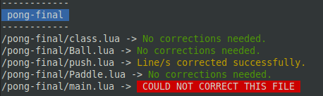

# CS50 .lua corrector
A python script to update the .lua files shared by CS50 to be read by Löve 11.3

# What you should know before using it:
* **The script *correct.py* is the only file in here you really need.** It runs with Python 3. (need help? [click here](https://realpython.com/installing-python/))
* It was made thinking to run in Linux. It should be working fine in Windows and MacOS by now, but I didn't test it yet. *
* Even though it should be safe to run this script, it is a good practice to have a backup of the *.lua* files before running it. But if the worst happens, you can download them again, right?
* It is also a good practice not to keep those files open in an IDE or in Löve while the script is running.\
* Edit: I believe the font colors aren't working when running it on Windows' cmd, PowerShell nor Python IDLE. But this is just an aesthetic detail. In this case, you may notice some "\033\[XXm" in the output.

# How to use it:
There are two ways to use this script:
## Specifying the directory of the files:
* Run the script in terminal (in Windows: *cmd* or *PowerShell*) by typping `python3 "path/to/correct.py" path/to/directory/with/CS50/files`.\
* The script will look for **all** files inside of the specified directory, and for all the files inside all its sub-directories.\
note 1: if the command `python3` fail, you can try `python` (more help? [click here](https://realpython.com/interacting-with-python/#running-a-python-script-from-the-command-line))\
note 2: although it may occasionally work, specifying the path to a single file is not fully supported yet.

## Without specifying the directory
* If there's no specified directory, the script will look for **all** files inside of the directory the script *correct.py* is located, and all the files inside all its sub-directories.
* To run the script then: type `python3 "path/to/correct.py"`\
note 1: if the command `python3` fail, you can try `python` (more help? [click here](https://realpython.com/interacting-with-python/#running-a-python-script-from-the-command-line))

## Examples:
Let's suppose you want to correct the files from the [pong](https://github.com/games50/pong) project.
* Specifying the path to the *pong* folder (which contains *"pong-0"*, *"pong-1"*, *"pong-2"*....): `python3 "path/to/correct.py" path/to/pong`\
* Specifying one of the sub-directories of *pong* folder: `python3 "path/to/correct.py" path/to/pong/pong-0`\
* If you downloaded more than one project from CS50, you can specify the directory where they are located to correct them all:  `python3 "path/to/correct.py" path/to/CS50_Projects`\
* Paste the script in the *pong* directory and run: `python3 "path/to/pong/correct.py"`\
* Paste the script in the directory containing other projects from CS50 and run: `python3 "path/to/CS50_Projects/correct.py"`\

## What was I supposed to see in its output?
The .lua files found by the script and what happened to them. Something like this:  

# Things you may be wondering:
## What projects from CS50 does this script corrects?
* [pong](https://github.com/games50/pong)
* [fifty-bird](https://github.com/games50/fifty-bird)
* [breakout](https://github.com/games50/breakout) (1 - see notes bellow)
* [match3](https://github.com/games50/match3)
* [mario](https://github.com/games50/mario) (alien version)
* [mario-demo](https://github.com/cs50/mario-demo) (mario version [from this YouTube video](https://www.youtube.com/watch?v=3k4CMAaNCuk))
* ~~[zelda](https://github.com/games50/zelda)~~ (I'm gonna need some help to fix this one)
* [angrybirds](https://github.com/games50/angrybirds)
* [pokemom](https://github.com/games50/pokemon)

\* 1 - some deprecated lines yet to be corrected from breakout 10 to 13, as seen in class video. but the game is still working.  

## There are some files I don't want this script to correct.
You can set those files as "read-only" files. It worked for me (in Linux), but I can't promise you it will work for you.  
Read again that "*it is a good practice to have a backup of the .lua files before running it*" part.  
In that case, the output should look like this (setting the file *main.lua* as read-only):

## I have found a bug.
Well, I'm sorry to hear that. Feel free to report it in "Issues" section, but I just need you to keep mind that my programming skills are just like my art skills: almost nonexistent. So it might take a while before I can solve it (if I'm able to do so. Please root for me).

## Wouldn't it be easier/faster to download the files from another source?
Yes... But it wouldn't help me to learn Python...

## Do you call that garbage as "code"?
"I'm not a real programmer, I just glue stuff together"
