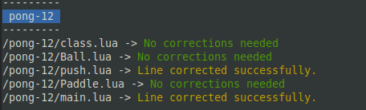

# CS50 .lua corrector
A python script to update the .lua files shared by CS50 to be read by Löve2D 11.3

# What you should know before using it:
* The script *correct.py* is the only file in here you really need. It runs with [Python 3](https://www.python.org/about/gettingstarted/) and its built-in packages.
* It was made thinking to run in Linux. It should be working fine in Windows and MacOS by now, but I didn't test it yet.
* Even though it should be safe to run this script, it is a good practice to have a backup of the .lua files before running it. But if the worst happens, you can download them again, right?
* It is also a good practice not to keep the files we're correcting open in an IDE or in Löve2D while the script is running.

# How to use it:
1. Paste the script *correct.py* in the main directory of a project shared by CS50, or a folder that contains it. (see instructions bellow)
2. Run the script: Open the main directory in terminal and type `python3 "correct.py"`  (need help? [click here](https://www.wikihow.com/Open-a-Python-File)) 

## The meaning of "main directory" in here:
Let's suppose you want to correct the files from the [pong](https://github.com/games50/pong) project. The *correct.py* script should be pasted in the *pong* folder (which contains *"pong-0"*, *"pong-1"*, *"pong-2"*....) or the folder that contains the *pong* among other CS50 projects. Just keep in mind that if you paste it in a folder containing all the projects from CS50, it may take a while to correct all the files.  
In case of this folder containing other .lua files (or folders that contains other .lua files) that are not from CS50, these files will be scanned too, and if the script find the patterns to correct in those files, it will try to correct them. Are you sure you want that to happen?

## What was I supposed to see in its output?
Blocks containing the .lua files the script was able to read, and what happened to them. Something like this:  

# Things you may be wondering:
## What projects from CS50 does this script corrects?
* [pong](https://github.com/games50/pong)
* [fifty-bird](https://github.com/games50/fifty-bird)
* [breakout](https://github.com/games50/breakout) (1 - see notes bellow)
* [match3](https://github.com/games50/match3)
* [mario](https://github.com/games50/mario) (alien version)
* [mario-demo](https://github.com/cs50/mario-demo) (mario)
* [zelda](https://github.com/games50/zelda) (currently in development)
* (more to come)

\* 1 - some deprecated lines yet to be corrected from breakout 10 to 13, as seen in class video. but the game is still working

## I have found a bug.
Well, I'm sorry to hear that. Feel free to report it in "Issues" section, but I just need you to keep mind that my programming skills are just like my art skills: almost nonexistent. So it might take a while before I can solve it (if I'm able to do so. Please root for me).

## Wouldn't it be easier/faster to download the files from another source?
Yes... But it wouldn't help me to learn Python...

## Do you call that garbage as "code"?
"I'm not a real programmer, I just glue stuff together"
